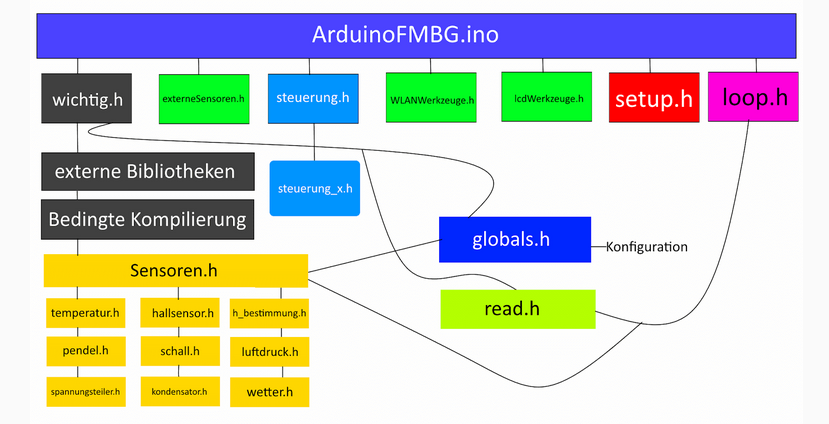

# ArduinoPhysik

*Bitte beachten:* Zurzeit scheint es in der "Arduino AVR Boards"-Plattform, die für das Kompilieren von ArduinoFMBG (Hauptsketch)
verwendet wird, einen Bug zu geben. Sie sollten deshalb auf Version 1.6.21 im Boardverwalter downgraden. 

Dies ist eine multifunktionale Plattform für den Einsatz von **Arduino-Sensoren im Physikunterricht**.

## Funktionsumfang
Die Messbox unterstützt folgende Sensoren
1. Temperatur/Luftfeuchtigkeit (basiert auf DHT-11)
2. Hallsensor (Messung der magnetischen Flussdichte, basiert auf UGN3503)
3. h-Bestimmung Simulation (viele Einstellmöglichkeiten)
4. Pendel (einstellbare Erkennungsdistanz, basiert auf HC-SR04)
5. Schall (Schalldruck und unbewerteter Schalldruckpegel)
6. Luftdruck (basiert auf BMP180-Modul)
7. Spannungsteiler (interaktive Übung zum Thema Spannungsteiler)
8. Kondensator (Kapazität, Funktionsgleichung)

Man kann über I2C weitere Daten an die Messbox schicken (für externe Sensoren) 

## Abhängigkeiten

| Bibliothek    | Autor      | Funktion    |
| ------------- |:-------------:| :-----:|
| [Adafruit GFX](https://github.com/adafruit/Adafruit-GFX-Library)    | [adafruit](https://github.com/adafruit)      | Grafikbiblitohek für Adafruit-LCDs    |
| [Adafruit_SSD1306](https://github.com/adafruit/Adafruit_SSD1306)    | [adafruit](https://github.com/adafruit)      | Bedienung von SSD1306-LCDs
| [Adafruit Sensor](https://github.com/adafruit/Adafruit_Sensor)      | [adafruit](https://github.com/adafruit)      | Basis für BMP180 und DHT11   |
|[BigNumber (mein Fork)](https://github.com/leonardoInf/BigNumber)     | [nickgammon](https://github.com/nickgammon)     | speicherintensive Berechnungen    |
| [BMP180 Breakout](https://github.com/sparkfun/BMP180_Breakout_Arduino_Library)     | [sparkfun](https://github.com/sparkfun)     | Bedienung des BMP180   |
|[DHT-sensor-library](https://github.com/adafruit/DHT-sensor-library)     |  [adafruit](https://github.com/adafruit)   |  Bedienung des DHT11   |
[HC-SR04](https://github.com/Martinsos/arduino-lib-hc-sr04)     | [Martinos](https://github.com/Martinsos)     | Bedienung des HC-SR04     |
| [Keypad](https://playground.arduino.cc/Code/Keypad/#Download)     | [MarkStanley](https://github.com/MarkStanley), [AlexanderBrevig](https://github.com/AlexanderBrevig)    | Navigation mit dem Keypad |

Standardmäßig wird ein 16x2 LiquidCrystal-LCD verwendet.\
Adafruit GFX und Adafruit SSD1306 werden nur benötigt, wenn man ein I2C-LCD einsetzen möchte.

**ESP8266X:** Um für ESP8266 kompilieren zu können, muss ``http://arduino.esp8266.com/stable/package_esp8266com_index.json`` als Boardverwalter-URL unter *Voreinstellungen* hinzugefügt werden.
Daraufhin muss im Boardverwalter das Board ``esp8266`` installiert werden.  

## Architektur

**Grundlegendes:** Die Grundlage bilden char-Arrays der Länge 40. Sie werden von dem derzeit ausgewählten Sensor erbittet und auf dem LCD dargestellt. 
Wenn das ausgewählte Modul die Darstellung auf dem LCD ändern möchte, muss es das entsprechende Array ``str_result[40]`` verändern. Auf Nutzereingaben wird mithilfe von globalen Variablen reagiert.
Die Kommunikation erfolgt über die jeweiligen Dateien ``steuerung_x.h``. 

``wichtig.h`` Abhängigkeiten, Implementierung der Konfiguration (siehe globals.h), Initialisierung der globalen Variablen, Initialisierung des Menüs

``externeSensoren.h`` Tool, um 'Screens' (d.h. darzustellende Zeichenketten) per I2C zu empfangen

``steuerung.h`` Hier ist fesgelegt, wie die einzelnen Module auf Nutzereingaben reagieren, hat viele Unterdateien

``WLANWerkzeuge.h`` Befehle per WLAN erhalten (nur ESP8266X)

``lcdWerkzeuge.h`` Schnittstelle: Code -> Dartellung

``setup.h`` Initialisierung der Box

``loop.h`` Die Hauptschleife. Sie erhält durchgehend Zeichenketten, welche dargestellt werden müssen und fetcht Nutzereingaben

``globals.h`` Enthält Deklaration globaler Variablen und Optionen zur Konfiguration der Box VOR der Kompilierung

``read.h`` Sorgt dafür, dass die Nutzereingaben vom Keypad in die Logik gelangen

``Sensoren.h`` Enthält die Implentierung der einzelnen Skripte für die Sensoren und Module. Je nach Konfiguration werden andere Module verwendet (u.a. wegen Speicherplatzproblem auf dem Arudino UNO). 

